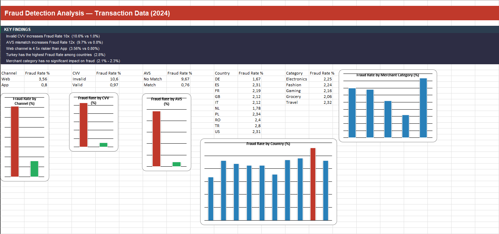

# 💳 **Fraud Detection Analysis (Excel EDA)**

## 📊 Dashboard Preview

## 📌 Project Overview

This project analyzes 300,000+ banking transactions to identify key fraud patterns using Microsoft Excel.

The goal is to detect high-risk transaction signals and understand what factors increase fraud probability.

## 🔍 Key Findings

- 🔴 Invalid CVV increases Fraud Rate 10x (10.6% vs 1.0%)

- 🔴 AVS mismatch increases Fraud Rate 12x (9.7% vs 0.8%)

- ⚠️ Web channel is 4.5x riskier than App (3.56% vs 0.80%)

- 🌍 Turkey has the highest Fraud Rate among countries (2.8%)

- ✅ Merchant category has no significant impact on fraud

## 💡 Business Recommendations
- Implement stricter verification for transactions with invalid CVV / AVS mismatch
  
- Add additional security checks for web-based transactions

- Monitor high-risk regions (e.g., Turkey)

- Focus fraud detection on transaction behavior rather than merchant category

## 🛠 Tools Used

- Microsoft Excel

- Pivot Tables

- Data Visualization (Charts)

## ⚙️ Project Workflow

1. Data Cleaning
    - Fixed date formats
    - Standardized numeric values
    - Removed empty columns
2. Descriptive Analysis
    - Transaction amount distribution
    - Fraud vs non-fraud comparison
3. EDA (Exploratory Data Analysis)
    - CVV validity
    - AVS match
    - Transaction channel
    - Country analysis
4. Dashboard Creation
    - Combined all insights into a single Excel dashboard

## 📈 Final Result

The analysis successfully identified key fraud indicators and provided actionable insights to reduce fraud risk.
